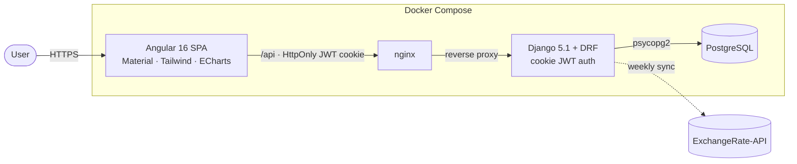
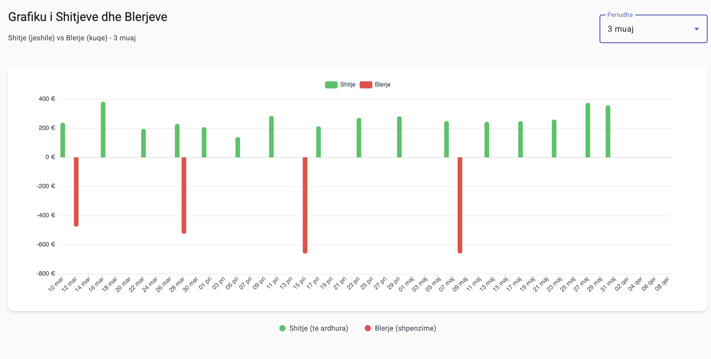
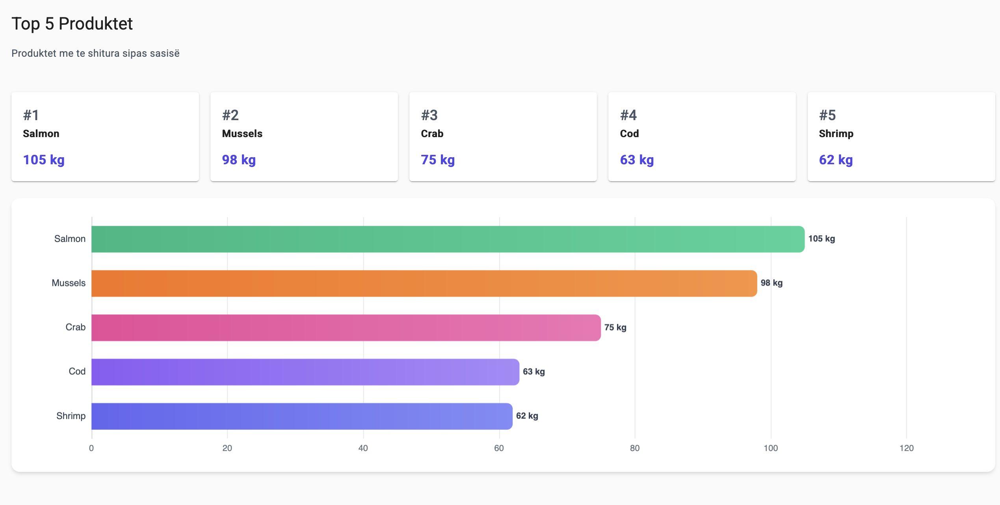
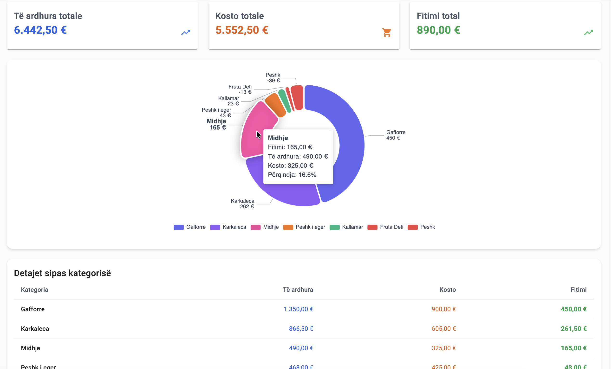
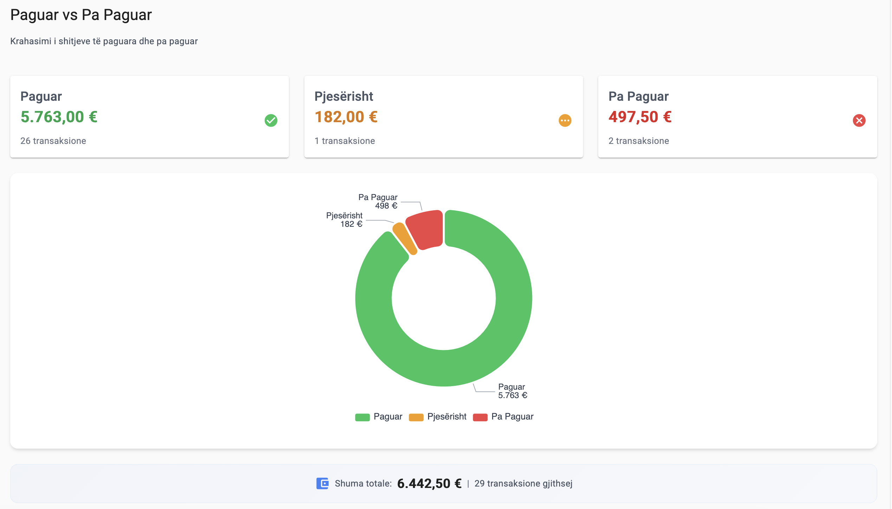
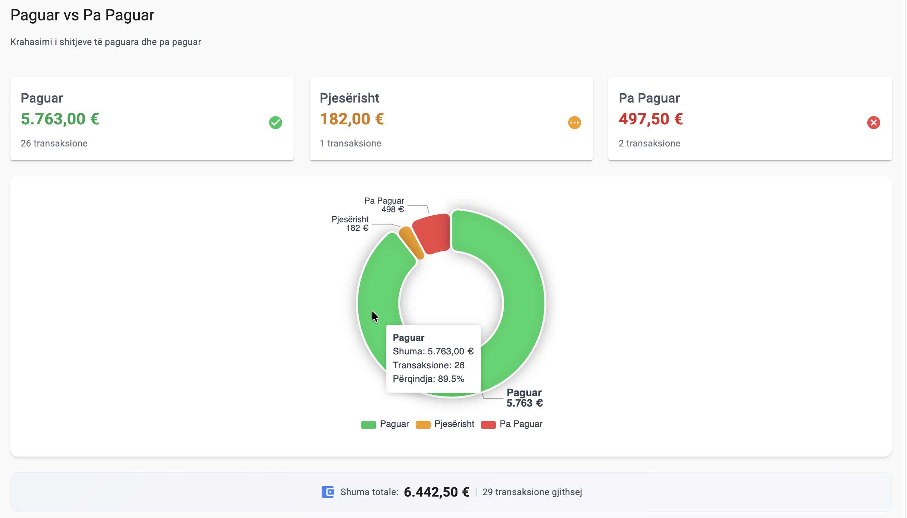
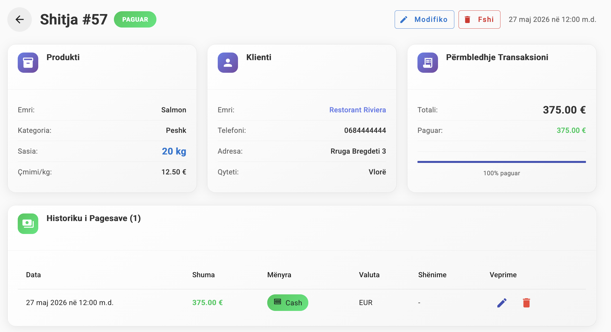
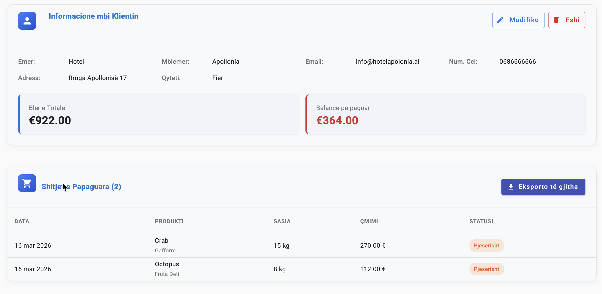
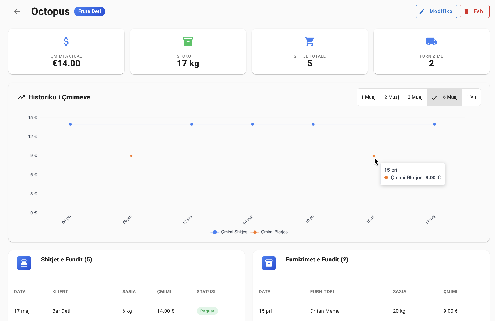
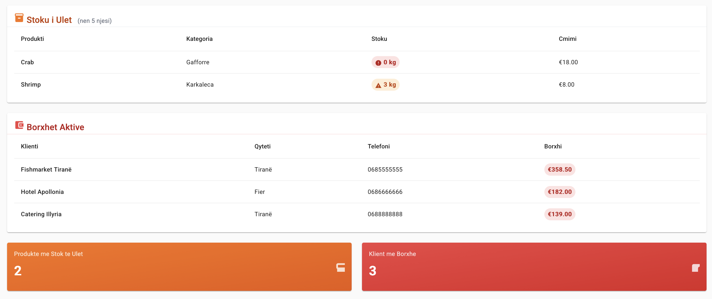

# Full-Stack ERP

A multi-currency ERP for small wholesale/retail businesses — inventory, sales, purchasing, clients/suppliers, a cash & bank ledger with partial and cross-currency payments, and live reporting dashboards. Built as a production-shaped Django + Angular monorepo that runs end-to-end with a single `docker compose up`.

<p>
  
  
  
  
  
</p>

> Why it exists: built to run a real multi-currency (EUR / USD / LEK) trading business where invoices are paid in installments and in whichever currency the customer has on hand — the accounting has to stay correct anyway.

## Architecture



**Request flow:** the SPA calls the API with an `HttpOnly`, `SameSite` JWT cookie (no token in JS). DRF authenticates via a cookie-aware `JWTAuthentication`. Exchange rates are fetched from an external API and cached in Postgres, refreshed weekly.

See the full entity-relationship diagram: [`db/ERdatabaseSchema.svg`](db/ERdatabaseSchema.svg).

## Tech stack

| Layer | Tech |
|---|---|
| Frontend | Angular 16, Angular Material, TailwindCSS, ngx-echarts, xlsx |
| Backend | Django 5.1, Django REST Framework, SimpleJWT (cookie-based), gunicorn |
| Database | PostgreSQL |
| Infra | Docker Compose, nginx |
| Quality | pytest, ruff, GitHub Actions, drf-spectacular (OpenAPI) |

## Features & Screenshots

### Real-time Dashboards
Comprehensive analytics with live data visualization, multi-currency support, and at-a-glance KPIs.

**Sales & Purchase Analytics**

*Track sales and purchase trends over time with detailed revenue breakdown.*

**Top Products & Customers**

*Identify your best-performing products by inventory moved.*


*Monitor top clients and suppliers with transaction volumes.*

### Payment & Cash Flow Management
Handle multi-currency payments, installments, and cross-currency settlements with auditable ledgers.

**Payment Status Overview**

*Visualize pending, partial, and completed payments at a glance.*

**Revenue Breakdown by Category**

*Track revenue, costs, and profit margins across product categories.*

### Transaction Management
Create, track, and manage sales and purchases with full audit trails.

**Transaction Details**

*View complete transaction history with line items, payment status, and client information.*

### Client & Product Management
Maintain detailed profiles with transaction history and inventory metrics.

**Client Information**

*Access client details, outstanding balances, transaction history, and purchase patterns.*

**Product Analytics**

*Monitor product pricing trends, inventory levels, sales velocity, and supplier activity.*

### Inventory & Supplier Tracking
Real-time stock monitoring with low-stock alerts and supplier management.


*Track current stock levels, manage suppliers, and monitor active account balances.*

## Quickstart

Requires Docker + Docker Compose.

```bash
git clone https://github.com/LedjoLleshaj/Full-stack-ERP.git
cd Full-stack-ERP

# Configure backend env (generates secrets locally; never commit .env)
cp backend/.env.example backend/.env
python3 -c "import secrets; print('SECRET_KEY=' + secrets.token_urlsafe(64))"   # paste into backend/.env

docker compose up --build
```

| Service | URL |
|---|---|
| Frontend | http://localhost:4200 |
| API (v1) | http://localhost:8080/api/v1/ |
| API docs (Swagger) | http://localhost:8080/api/docs |
| API health | http://localhost:8080/erp/health/ |
| Django admin | http://localhost:8080/admin |

Migrations run automatically on backend startup; a demo admin (`admin` / `adminpass`) is seeded by [`backend/entrypoint.sh`](backend/entrypoint.sh) — change these before any non-local use.

## API documentation

Once running, interactive OpenAPI docs are available at **http://localhost:8080/api/docs**.

The versioned REST API lives at `/api/v1/` (paginated, ViewSet-based). Legacy routes under `/erp/` remain for backward compatibility.

## Project structure

```
.
├── backend/            # Django 5.1 + DRF
│   ├── erp/            # domain app
│   │   ├── api/        # view functions (legacy routes)
│   │   ├── services/   # business logic (inventory, payments)
│   │   ├── viewsets.py # /api/v1/ ViewSets
│   │   └── tests/      # pytest suite
│   └── backend/        # Django project settings
├── frontend/           # Angular 16 SPA
├── db/                 # ER diagram, seed data, cleanup scripts
├── docs/               # deployment guide, schema guide
└── docker-compose.yml
```

## Data model & key decisions

The domain is 13 models. The interesting choices (and their trade-offs):

- **Transaction ↔ Payment ledger.** A `Transaction` (PURCHASE or SALE) carries a total; one or more `Payment` rows settle it. Status (`PENDING` → `PARTIAL` → `COMPLETED`) is derived from payments vs. total. This is what makes **installment payments** first-class instead of a boolean `is_paid`.
- **Cross-currency settlement.** A sale in EUR can be paid in LEK: the `Payment` stores both the converted amount (transaction currency) and the `original_amount`/`original_currency`/`exchange_rate` used. Rates come from a cached `ExchangeRate` table synced weekly.
- **Account ledger.** Every payment moves money in/out of a cash or bank `Account` via an `AccountTransaction` row that records `balance_after`, giving an auditable running balance per account.
- **Soft deletes.** Clients, suppliers, and products use `is_active` flags rather than row deletion, preserving historical transactions.
- **Decimal money.** All monetary values are `DECIMAL` (never float) to avoid rounding errors in accounting.
- **Cookie-based JWT.** Access/refresh tokens live in `HttpOnly` `SameSite` cookies (XSS-resistant) rather than `localStorage`; the trade-off is CSRF surface, mitigated by `SameSite` and same-origin proxying.

## Testing

```bash
# Backend
cd backend && pytest            # or: python manage.py test erp

# Frontend
cd frontend && npm test
```

## License

[MIT](LICENSE)
