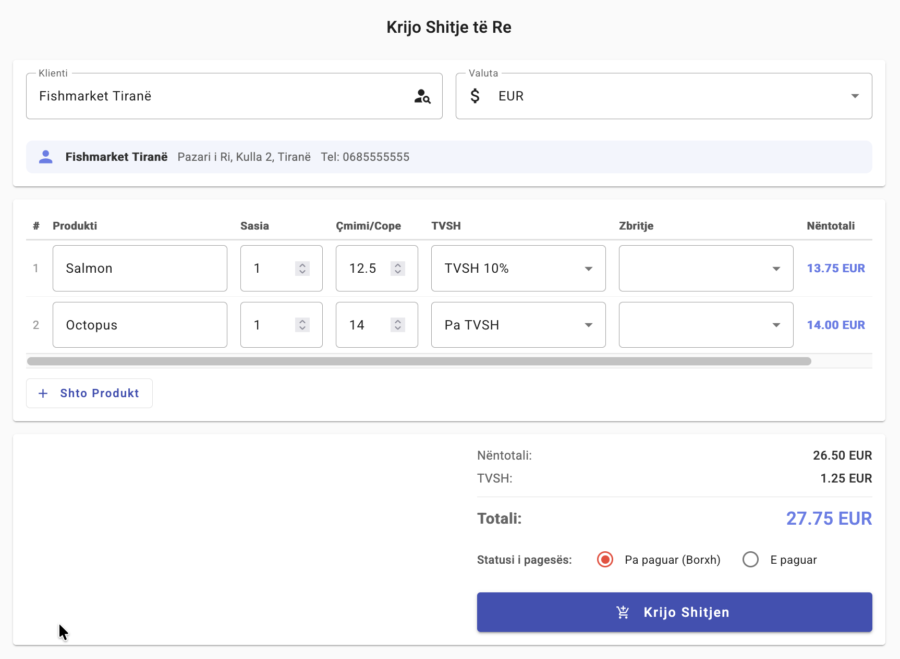
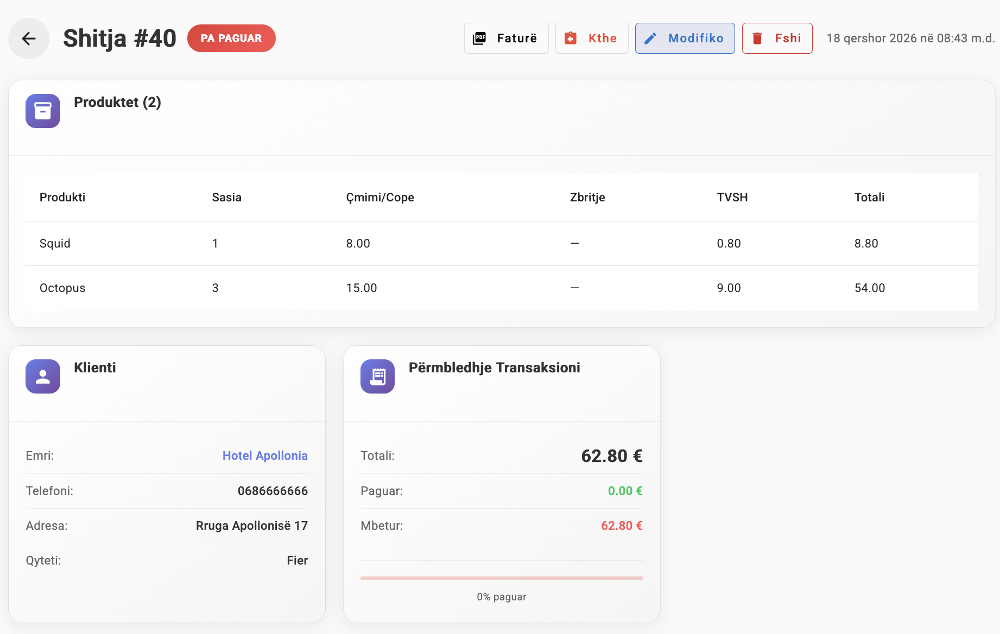

# Full-Stack ERP

A multi-currency ERP for small wholesale/retail businesses — inventory, sales, purchasing, clients/suppliers, a cash & bank ledger with partial and cross-currency payments, and live reporting dashboards. Built as a production-shaped Django + Angular monorepo that runs end-to-end with a single `docker compose up`.

<p>
  
  
  
  
  
</p>

> Why it exists: built to run a real multi-currency (EUR / USD / LEK) trading business where invoices are paid in installments and in whichever currency the customer has on hand — the accounting has to stay correct anyway.

## Architecture


**Request flow:** the SPA calls the API with an `HttpOnly`, `SameSite` JWT cookie (no token in JS). DRF authenticates via a cookie-aware `JWTAuthentication`. Exchange rates are fetched from an external API and cached in Postgres, refreshed weekly.

See the full entity-relationship diagram: [`db/ERdatabaseSchema.svg`](db/ERdatabaseSchema.svg).

## Tech stack

| Layer    | Tech                                                                  |
| -------- | --------------------------------------------------------------------- |
| Frontend | Angular 16, Angular Material, TailwindCSS, ngx-echarts, xlsx          |
| Backend  | Django 5.1, Django REST Framework, SimpleJWT (cookie-based), gunicorn |
| Database | PostgreSQL                                                            |
| Infra    | Docker Compose, nginx                                                 |
| Quality  | pytest, ruff, GitHub Actions, drf-spectacular (OpenAPI)               |

## Features & Screenshots

### Real-time Dashboards

Comprehensive analytics with live data visualization, multi-currency support, and at-a-glance KPIs.

**Sales & Purchase Analytics**

_Track sales and purchase trends over time with detailed revenue breakdown._

**Top Products & Customers**

_Identify your best-performing products by inventory moved._


_Monitor top clients and suppliers with transaction volumes._

### Payment & Cash Flow Management

Handle multi-currency payments, installments, and cross-currency settlements with auditable ledgers.

**Payment Status Overview**

_Visualize pending, partial, and completed payments at a glance._

**Revenue Breakdown by Category**

_Track revenue, costs, and profit margins across product categories._

### Transaction Management

Create, track, and manage sales and purchases with full audit trails.

**Transaction Details**

_View complete transaction history with line items, payment status, and client information._

**Multi-Item Invoice Builder**

_Build multi-product sales in one form — per-line quantity, price, VAT, and discount with live subtotal and grand total._

**Sale Detail**

_Review a completed sale with per-item VAT breakdown, client info, and a payment summary showing paid vs. outstanding balance._

### Client & Product Management

Maintain detailed profiles with transaction history and inventory metrics.

**Client Information**

_Access client details, outstanding balances, transaction history, and purchase patterns._

**Product Analytics**

_Monitor product pricing trends, inventory levels, sales velocity, and supplier activity._

### Inventory & Supplier Tracking

Real-time stock monitoring with low-stock alerts and supplier management.


_Track current stock levels, manage suppliers, and monitor active account balances._

## Quickstart

Requires Docker + Docker Compose.

```bash
git clone https://github.com/LedjoLleshaj/Full-stack-ERP.git
cd Full-stack-ERP

# Configure backend env (generates secrets locally; never commit .env)
cp backend/.env.example backend/.env
python3 -c "import secrets; print('SECRET_KEY=' + secrets.token_urlsafe(64))"   # paste into backend/.env

docker compose up --build
```

| Service            | URL                               |
| ------------------ | --------------------------------- |
| Frontend           | http://localhost:4200             |
| API (v1)           | http://localhost:8080/api/v1/     |
| API docs (Swagger) | http://localhost:8080/api/docs    |
| API health         | http://localhost:8080/erp/health/ |
| Django admin       | http://localhost:8080/admin       |

Migrations run automatically on backend startup; a demo admin (`admin` / `adminpass`) is seeded by [`backend/entrypoint.sh`](backend/entrypoint.sh) — change these before any non-local use.

## Make commands

The project includes a [`Makefile`](Makefile) with shortcuts for common operations. All commands run from the repo root.

| Command | What it does | When to use |
| --- | --- | --- |
| `make up` | Builds and starts all Docker containers in detached mode (`docker compose up --build -d`) | **Quick run / first launch.** Spin up the full stack (nginx, API, DB, frontend) to test the app end-to-end. Also use after pulling new changes to rebuild images. |
| `make down` | Stops and removes all containers (`docker compose down`) | When you're done working and want to free up resources. Preserves database volumes. |
| `make build` | Builds Docker images without starting containers (`docker compose build`) | When you only need to verify that images build successfully (e.g., after changing a Dockerfile or dependencies) without running the stack. |
| `make test` | Runs the backend pytest suite (`pytest -v`) using the local `.venv` | **Development.** Run frequently while writing code. Uses SQLite in-memory (via `settings_test`), so no Docker needed. |
| `make lint` | Runs ruff linter on the backend (`ruff check erp/`) | **Development.** Check for code style issues and errors before committing. |
| `make lint-fix` | Runs ruff with `--fix` to auto-correct lint issues | **Development.** Quickly fix auto-fixable lint errors (unused imports, formatting, etc.). |
| `make migrate` | Applies Django migrations using the local `.venv` | **Development.** After creating or pulling new migrations, run this to update your local database schema. |
| `make shell` | Opens a Django interactive shell | **Development / debugging.** Explore models, test queries, or inspect data interactively via the Django ORM. |
| `make seed` | Loads `db/seed.sql` into the running Postgres container | **After `make up`.** Populate the database with sample data for manual testing or demos. Requires the Docker stack to be running. |
| `make clean` | Stops containers **and removes volumes** (`docker compose down -v`) | **Nuclear reset.** Destroys the database and all container state. Use when you want a completely fresh start. |

### Typical workflows

**Quick demo / full-stack test:**
```bash
make up        # start everything
make seed      # load sample data
# open http://localhost:4200
make down      # stop when done
```

**Day-to-day development:**
```bash
make test      # run tests (no Docker needed)
make lint-fix  # auto-fix lint issues
make migrate   # apply new migrations locally
```

**Fresh start (wipe database):**
```bash
make clean     # stop + delete volumes
make up        # rebuild from scratch
```

## API documentation

Once running, interactive OpenAPI docs are available at **http://localhost:8080/api/docs**.

The versioned REST API lives at `/api/v1/` (paginated, ViewSet-based). Legacy routes under `/erp/` remain for backward compatibility.

## Project structure

```
.
├── backend/            # Django 5.1 + DRF
│   ├── erp/            # domain app
│   │   ├── api/        # view functions (legacy routes)
│   │   ├── services/   # business logic (inventory, payments)
│   │   ├── viewsets.py # /api/v1/ ViewSets
│   │   └── tests/      # pytest suite
│   └── backend/        # Django project settings
├── frontend/           # Angular 16 SPA
├── db/                 # ER diagram, seed data, cleanup scripts
├── docs/               # deployment guide, schema guide
└── docker-compose.yml
```

## Data model & key decisions

The domain is 13 models. The interesting choices (and their trade-offs):

- **Transaction ↔ Payment ledger.** A `Transaction` (PURCHASE or SALE) carries a total; one or more `Payment` rows settle it. Status (`PENDING` → `PARTIAL` → `COMPLETED`) is derived from payments vs. total. This is what makes **installment payments** first-class instead of a boolean `is_paid`.
- **Cross-currency settlement.** A sale in EUR can be paid in LEK: the `Payment` stores both the converted amount (transaction currency) and the `original_amount`/`original_currency`/`exchange_rate` used. Rates come from a cached `ExchangeRate` table synced weekly.
- **Account ledger.** Every payment moves money in/out of a cash or bank `Account` via an `AccountTransaction` row that records `balance_after`, giving an auditable running balance per account.
- **Soft deletes.** Clients, suppliers, and products use `is_active` flags rather than row deletion, preserving historical transactions.
- **Decimal money.** All monetary values are `DECIMAL` (never float) to avoid rounding errors in accounting.
- **Cookie-based JWT.** Access/refresh tokens live in `HttpOnly` `SameSite` cookies (XSS-resistant) rather than `localStorage`; the trade-off is CSRF surface, mitigated by `SameSite` and same-origin proxying.

## Testing

```bash
# Backend
cd backend && pytest            # or: python manage.py test erp

# Frontend
cd frontend && npm test
```

## License

[MIT](LICENSE)
