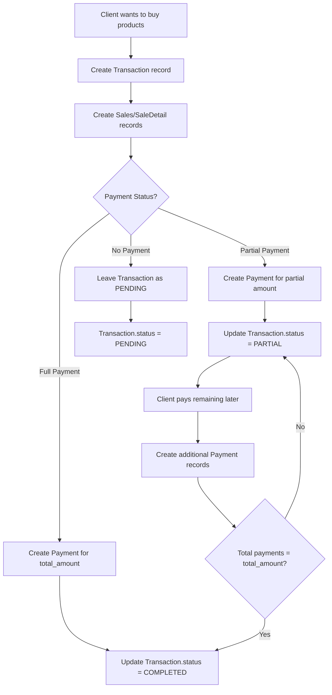

# Database Schema Analysis & Partial Payment Guide

## How to Make Sales with Partial Payments

### Workflow Overview



### Step-by-Step Process

#### **Step 1: Create a SALE Transaction**

```sql
INSERT INTO Transaction (
    transaction_type,
    client_id,
    total_amount,
    currency,
    status,
    invoice_number,
    notes
) VALUES (
    'SALE',                    -- Transaction type
    1,                         -- Client ID (e.g., Ledjo)
    500.00,                    -- Total amount for the sale
    'EUR',                     -- Currency
    'PENDING',                 -- Initial status
    'SAL-2025-100',           -- Invoice number
    'Sale of salmon and koce'  -- Notes
) RETURNING id;
```

**Result:** You get a `transaction_id` (e.g., 42)

---

#### **Step 2: Create Sale Records**

```sql
-- For each product sold, create a Sales record
INSERT INTO Sales (
    transaction_id,
    prod_id,
    prod_price,
    user_id,
    quantity
) VALUES
    (42, 1, 10.00, 1, 20),  -- 20kg Salmon at 10 EUR/kg
    (42, 3, 20.00, 1, 15);  -- 15kg Koce at 20 EUR/kg
```

**Total:** (20 × 10) + (15 × 20) = 200 + 300 = **500 EUR**

---

#### **Step 3: Record Payment(s)**

##### **Scenario A: Client Pays Full Amount**

```sql
INSERT INTO Payment (
    transaction_id,
    account_id,
    amount,
    currency,
    payment_method,
    notes
) VALUES (
    42,                          -- Transaction ID
    1,                           -- Account (Cash EUR)
    500.00,                      -- Full amount
    'EUR',
    'CASH',
    'Full payment received'
);

-- Update transaction status
UPDATE Transaction
SET status = 'COMPLETED',
    completed_date = CURRENT_TIMESTAMP
WHERE id = 42;
```

##### **Scenario B: Client Pays Partial Amount (e.g., 200 EUR today)**

```sql
INSERT INTO Payment (
    transaction_id,
    account_id,
    amount,
    currency,
    payment_method,
    notes
) VALUES (
    42,
    1,                           -- Cash EUR account
    200.00,                      -- Partial payment
    'EUR',
    'CASH',
    'Partial payment 1 of total 500 EUR'
);

-- Update transaction status
UPDATE Transaction
SET status = 'PARTIAL'
WHERE id = 42;
```

**Remaining balance:** 500 - 200 = **300 EUR**

##### **Scenario C: No Payment Yet (Credit)**

```sql
-- Don't create any Payment record
-- Transaction.status remains 'PENDING'
```

---

#### **Step 4: Client Pays Remaining Amount Later**

A week later, the client pays the remaining 300 EUR:

```sql
INSERT INTO Payment (
    transaction_id,
    account_id,
    amount,
    currency,
    payment_method,
    notes
) VALUES (
    42,
    4,                           -- Bank EUR account
    300.00,                      -- Remaining amount
    'EUR',
    'CARD',
    'Final payment completing transaction'
);

-- Update transaction status
UPDATE Transaction
SET status = 'COMPLETED',
    completed_date = CURRENT_TIMESTAMP
WHERE id = 42;
```

---

#### **Step 5: Track Account Balances**

When each payment is made, record the account movement:

```sql
INSERT INTO AccountTransaction (
    account_id,
    payment_id,
    transaction_type,
    amount,
    balance_after,
    notes
) VALUES (
    1,                           -- Cash EUR account
    <payment_id>,               -- ID from Payment table
    'DEPOSIT',                   -- Money coming in (SALE)
    200.00,
    5200.00,                     -- New balance after deposit
    'Partial payment from client for SAL-2025-100'
);
```

---

## Querying Payment Status

### Check Total Paid vs Total Amount

```sql
SELECT
    t.id,
    t.invoice_number,
    t.total_amount,
    t.status,
    COALESCE(SUM(p.amount), 0) as total_paid,
    t.total_amount - COALESCE(SUM(p.amount), 0) as remaining_balance
FROM Transaction t
LEFT JOIN Payment p ON t.id = p.transaction_id
WHERE t.transaction_type = 'SALE'
GROUP BY t.id, t.invoice_number, t.total_amount, t.status;
```

### Get Client's Unpaid/Partial Transactions

```sql
SELECT
    c.firstname,
    c.lastname,
    t.invoice_number,
    t.total_amount,
    t.status,
    COALESCE(SUM(p.amount), 0) as paid,
    t.total_amount - COALESCE(SUM(p.amount), 0) as debt
FROM Client c
JOIN Transaction t ON c.id = t.client_id
LEFT JOIN Payment p ON t.id = p.transaction_id
WHERE t.transaction_type = 'SALE'
  AND t.status IN ('PENDING', 'PARTIAL')
GROUP BY c.id, c.firstname, c.lastname, t.id, t.invoice_number, t.total_amount, t.status
ORDER BY t.created_date;
```

---

## Current Schema State

The Sales model references a Transaction via `transaction_id` FK. The earlier `is_paid` and `client_id` columns have been removed — payment status is now derived from the Transaction → Payment chain, and client association lives on the Transaction.

This migration has already been applied. The SQL migration options previously documented here are no longer needed.

---

## Summary

> [!IMPORTANT] > **Key Takeaways**
>
> 1. Link `Sales` table to `Transaction` table via `transaction_id`
> 2. Use `Transaction.status` to track payment state: PENDING, PARTIAL, COMPLETED
> 3. Create multiple `Payment` records for partial payments
> 4. Query total payments to calculate remaining balance
> 5. Update `Transaction.status` when payments are made

> [!TIP] > **Best Practice for Partial Payments**
>
> - Always create the `Transaction` record first
> - Create `Sales` records linked to the transaction
> - Add `Payment` records as money is received
> - Update `Transaction.status` based on total payments vs total amount
> - Use `AccountTransaction` to track actual cash flow

The current `Transaction`/`Payment` system is already well-designed for partial payments. You just need to connect your `Sales` and `Restock` tables to leverage this functionality!
