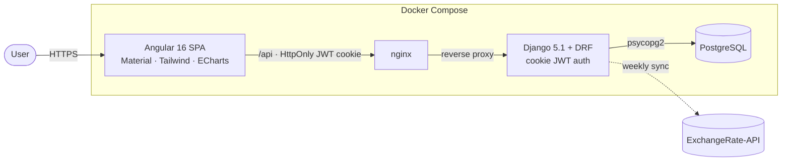

# Full-Stack ERP — Refactor, Hardening & Presentation Plan

> **For agentic workers:** REQUIRED SUB-SKILL: Use `superpowers:subagent-driven-development` (recommended) or `superpowers:executing-plans` to implement this plan task-by-task. Steps use checkbox (`- [ ]`) syntax for tracking. Implement **phase by phase**; each phase ends with a green build and is independently shippable as its own PR.

**Goal:** Turn a 349-commit, no-README flagship repo into something a senior ERP reviewer reads as a serious, production-shaped project — fixing the security holes, data-model defects, and broken first-run experience along the way.

**Architecture:** Angular 16 SPA (Material + Tailwind + ECharts) → nginx → Django 5.1 + DRF (cookie-based JWT) → PostgreSQL. Multi-currency (EUR/USD/LEK) inventory + sales + purchasing + accounts/payments ledger with partial & cross-currency payments, plus reporting dashboards.

**Tech Stack:** Python 3.11, Django 5.1, djangorestframework, djangorestframework-simplejwt, psycopg2, gunicorn; Angular 16, TypeScript 5, Angular Material, TailwindCSS, ngx-echarts, xlsx; PostgreSQL; Docker Compose; (added by this plan) ruff, pytest/pytest-django, drf-spectacular, GitHub Actions.

---

## TL;DR

**What this is:** a public flagship ERP repo (Django + Angular + Postgres + Docker, 349 commits) that renders **no README** and carries critical defects a senior reviewer catches in the first 60 seconds. This plan fixes presentation **and** substance across 7 PR-sized phases.

**The five that disqualify the repo today:**
1. **No root README** — 404 on `main`/`master`. → Phase 1
2. **`docker compose up` builds zero ERP tables** (empty `migrations/` + commented-out schema mount) → every endpoint 500s. → Phase 2
3. **Seeded admin can't log in** — app authenticates against the custom `Users` table, the seeder writes Django's `auth_user`. → Phase 3
4. **User CRUD broken + insecure** — `createUser` passes fields that don't exist on the model (500s); `updateUser` stores passwords in **plaintext**. → Phase 3
5. **`backend/.env` (SECRET_KEY + DB password) committed & still in history; root `.gitignore` exists but doesn't ignore `.env`.** → Phase 0

**Start here:** Phase 0 → 1 → 2. That sequence removes every 🔴 a reviewer hits first. Phases 3–6 add depth (auth, data model, API, CI).

**Phase map:** 0 hygiene/secrets · 1 README · 2 working first-run · 3 auth · 4 data model · 5 API · 6 CI. One branch + one PR per phase; each ends green and ships independently.

**On the committed secret:** the keys are unused (project not deployed), so the point isn't exploitation — it's that a **public** profile shows a committed-secret mistake. The fix is scrubbing `backend/.env` from git history (rotation optional). `git rm` is not enough — see Phase 0.

---

## Reviewer's Verdict (the brutal version)

> Read this as the demanding ERP lead who clicked your #1 pin and was *not* impressed. Every claim below is backed by a file reference. Fix the verdict, not just the README.

This repo has real bones — 13 domain models, a proper payments/ledger design, cross-currency settlement, dashboards, and ~2,200 lines of tests. That makes the unforced errors worse, not better, because a reviewer assumes you didn't notice them.

### 🔴 Critical — these get the project rejected

1. **No root README.** 404 on `main` and `master`. The single highest-ROI artifact in the repo does not exist. (This plan's Phase 1.)
2. **`docker compose up` produces a non-working app.** `backend/erp/migrations/` is **empty** (no `0001_initial`, not even `__init__.py`), so `manage.py migrate` in [backend/entrypoint.sh:12](backend/entrypoint.sh) creates only Django's built-in tables — **none of the ERP tables**. The only DDL lives in `db/schema.sql`, and its init mount is **commented out** in [docker-compose.yml:12-13](docker-compose.yml). Fresh clone → `docker compose up` → every endpoint 500s. The headline quickstart is broken before it's written.
3. **Two parallel, mutually-incompatible user systems.** The app authenticates against the custom `Users` model ([backend/erp/api/auth.py:28](backend/erp/api/auth.py)), but the seeded admin in [backend/entrypoint.sh:14-18](backend/entrypoint.sh) is created via `get_user_model()` → Django's `auth_user` table. **The seeded superuser cannot log into the application.** Two sources of truth for identity in an ERP is a non-starter.
4. **User management API is broken *and* insecure.** [backend/erp/api/users.py:38-52](backend/erp/api/users.py) `createUser` passes `first_name`, `last_name`, `phone`, `city` — **none of which exist** on the `Users` model (real fields: `firstname`, `lastname`, `role`) → `TypeError` on every call; a misplaced inline comment also swallows `email=`. [backend/erp/api/users.py:62](backend/erp/api/users.py) `updateUser` writes `user.password = data["password"]` **in plaintext**, silently destroying the login of any edited user.
5. **Committed `.env`; `.gitignore` doesn't cover it.** A root `.gitignore` **exists** but does **not** list `.env`, so `backend/.env` (315 bytes, real `SECRET_KEY` + `DB_PASSWORD`) is committed and still in history. Build artifacts are *not* actually tracked: the existing `.gitignore` already ignores `venv/`, `__pycache__/`, and `.DS_Store`; `node_modules/`, `dist/`, `.angular/` are un-ignored but happen to be untracked too. So the only tracked offender is `backend/.env`. On a **public** repo this advertises a committed-secret mistake in plain view (commit history + blame); it must be scrubbed from history (rotation optional — the project isn't deployed, so the values are dead).
6. **Insecure-by-default secret key.** [backend/backend/settings.py:14](backend/backend/settings.py) falls back to `"django-insecure-default-key-change-in-production"` when `SECRET_KEY` is unset — fail-open. Production can boot on a publicly-known key.

### 🟠 High — an ERP specialist will hammer these

7. **Money fields cap at 999,999.99.** Every monetary column is `DECIMAL(8,2)` — in the models ([backend/erp/models.py:127](backend/erp/models.py) `current_balance`, `:167` `total_amount`, `:198` `amount`, `:241` `balance_after`, `:264` `price`, `:338` `prod_price`, `:363` `restock_price`) **and** in [db/schema.sql:51,81,101,118,128,157,171](db/schema.sql). A balance or invoice ≥ 1,000,000 of any currency (trivially reachable in LEK) raises on save. Unacceptable for accounting software.
8. **ORM and SQL schema have already drifted.** `db/SCHEMA_GUIDE.md` documents `Sales.is_paid` and `Sales.client_id` ([db/SCHEMA_GUIDE.md:247,258-259](db/SCHEMA_GUIDE.md)) that **do not exist** in the current `Sales` model ([backend/erp/models.py:333-354](backend/erp/models.py)). With no migrations as a single source of truth, drift is guaranteed to continue.
9. **No business-rule validation.** Quantities are bare `IntegerField` with no `MinValueValidator` ([backend/erp/models.py:288,340,362](backend/erp/models.py)); nothing prevents selling below available stock or negative amounts. The TODO already admits this ([TODO.md:9-10](TODO.md)).
10. **Redundant catalog modeling.** `Product.category` is a free-text `CharField` ([backend/erp/models.py:263](backend/erp/models.py)) while `Product_Categories` + `Product_Names` ([backend/erp/models.py:304-330](backend/erp/models.py)) model the same concept relationally. Two competing catalogs; no FK from `Product` to `Product_Categories`.
11. **Ambiguous inventory source of truth.** Stock is implied by append-only `Inventory` rows ([backend/erp/models.py:286-301](backend/erp/models.py)) plus `Restock` (in) and `Sales` (out), with no authoritative on-hand quantity. "Current stock" is uncomputable without a documented rule.
12. **No authenticated rate limiting.** Only `anon` is throttled at 5/min ([backend/backend/settings.py:154-156](backend/backend/settings.py)). A stolen token is unthrottled.
13. **Refresh-token rotation/blacklist is a no-op.** `BLACKLIST_AFTER_ROTATION=True` ([backend/backend/settings.py:164](backend/backend/settings.py)) but `rest_framework_simplejwt.token_blacklist` is not in `INSTALLED_APPS`; [backend/erp/api/auth.py:103-105](backend/erp/api/auth.py) swallows the resulting `AttributeError`. Logout/rotation does not actually invalidate tokens.

### 🟡 Medium — credibility and maintainability

14. **No CI, no LICENSE, no API docs.** No `.github/workflows`, no license file, 115 endpoints with zero machine-readable schema.
15. **Verb-based, unversioned, unpaginated API.** ~115 routes like `add-product`, `delete-user/<pk>` ([backend/erp/urls.py](backend/erp/urls.py)); list endpoints return entire tables; no `/api/v1/` prefix.
16. **Frontend smells.** Package name is `renflix-frontend` v`0.0.0` ([frontend/package.json:2](frontend/package.json)); Angular 16 (out of LTS); `environment.ts` carries both "grouped" and "legacy flat" endpoint maps ([frontend/src/environments/environment.ts](frontend/src/environments/environment.ts)).
17. **Stray test module.** `backend/erp/tests.py` (3 lines) shadows the real `backend/erp/tests/` package.
18. **Docs are templated stubs.** `DEPLOYMENT.md` references `.env.prod.example` and `frontend/nginx.prod.conf` that don't exist and uses `your-erp-app`/`yourdomain.com` placeholders throughout.
19. **Startup side-effects per worker.** Exchange-rate auto-sync spawns a thread in `AppConfig.ready()` ([backend/erp/apps.py:13-61](backend/erp/apps.py)); with gunicorn `--workers 4` ([backend/Dockerfile:32](backend/Dockerfile)) that's up to 4 concurrent syncs on boot.

**Bottom line:** the narrative gap (no README) is the symptom. The disqualifiers are #2–#6. Fix presentation *and* substance or the README writes a check the codebase can't cash.

---

## Execution Order & Phases

Phases are ordered by ROI and dependency. **Phase 0 → 1 alone** flips the repo from "bounces reviewers" to "looks serious." Phases 2–3 make the README's claims true. 4–6 are depth.

| Phase | Theme | Severity | Independently shippable |
|------:|-------|----------|--------------------------|
| 0 | Repo hygiene & secret remediation | ✅ DONE | yes |
| 1 | README & presentation layer | ✅ DONE | yes |
| 2 | Working first-run + migrations as source of truth | ✅ DONE | yes |
| 3 | Identity & auth correctness | 🔴 | yes |
| 4 | Data-model integrity (money, validation, catalog) | 🟠 | yes |
| 5 | API quality (versioning, pagination, docs, errors) | 🟡 | yes |
| 6 | CI, code quality & frontend cleanup | 🟡 | yes |

**Global conventions for the implementer**
- Work on a branch per phase: `git switch -c phaseN-short-name`. Commit after every passing step. Open one PR per phase.
- Backend tests run with `pytest` from `backend/` (a `conftest.py` already exists). If `pytest-django` is absent, Phase 6 adds it; until then, fall back to `python manage.py test erp`.
- Never print secret values into the terminal, logs, commits, or PR descriptions.
- After each phase, run the phase's **Acceptance** block and paste real output into the PR before claiming done (per `superpowers:verification-before-completion`).

---

## Phase 0 — Repo Hygiene & Secret Remediation ✅ DONE

**Outcome:** clean working tree, no tracked secrets or build artifacts, rotated credentials, LICENSE present.

**Files:**
- Extend: `.gitignore` (root — already exists; add `.env`, `node_modules/`, `dist/`, `.angular/`)
- Create: `LICENSE`, `backend/.gitignore`
- Modify: `frontend/package.json:2-3`
- Remove from tracking: `backend/.env` (the only tracked offender; `venv/`/`node_modules/`/`dist/`/`.angular/`/`.DS_Store` are already untracked)

- [x] **Step 1: Extend the existing root `.gitignore`**

A root `.gitignore` already exists but omits `.env` and the Node/Angular artifacts. **Merge** the rules below into it — do not overwrite, it has project-specific entries (e.g. `db/tempo.sql`, `backend/Auth.md`, benchmark files). The additions that matter are the `Secrets / env` and `Node / Angular` sections.

```gitignore
# ---- OS ----
.DS_Store
Thumbs.db

# ---- Python / Django ----
__pycache__/
*.py[cod]
*.egg-info/
.venv/
venv/
env/
*.sqlite3
staticfiles/
backend/staticfiles/
.coverage
htmlcov/
.pytest_cache/
.ruff_cache/

# ---- Secrets / env ----
.env
.env.*
!.env.example
!.env.prod.example

# ---- Node / Angular ----
node_modules/
dist/
.angular/
*.log
npm-debug.log*

# ---- Docker / runtime ----
logs/
backups/
postgres_data/
```

- [x] **Step 2: Stop tracking the committed secret**

Only `backend/.env` is actually tracked (the build artifacts above are already untracked), so the removal is a single file:

```bash
git rm --cached --quiet backend/.env
git add .gitignore
git commit -m "chore: stop tracking backend/.env; extend .gitignore"
```

- [x] **Step 3: Scrub `backend/.env` from ALL git history (primary goal — clean the public profile)**

The keys are unused (project isn't deployed), so the risk isn't exploitation — it's that a **public** profile shows a committed-secret mistake. Critical point: **`git rm --cached` does NOT fix this.** It only stops tracking the file going forward; every past commit still contains `backend/.env`, fully visible on GitHub via commit view, blame, and raw URLs. The only fix is rewriting history and force-pushing.

Removing the file is not enough on its own — the same `SECRET_KEY`/`DB_PASSWORD` values may also sit in old commits of other files (e.g. `backend/README.md` quickstart blocks), in earlier versions of `docker-compose.yml`, or in commit messages. Scrub by **file** and by **value**.

```bash
# 1. Find every commit that ever touched a secret FILE (catch strays, not just backend/.env)
git log --all --oneline -- 'backend/.env' '**/.env' '*.env'

# 2. Find the secret VALUES anywhere in history — files AND commit messages.
#    Read the real values from your current backend/.env, then search by a distinctive
#    fragment of each (avoid typing the full secret into shell history).
git log --all --oneline -S 'django-insecure'              # the default-key fallback string
git log --all -p     -S '<first-12-chars-of-SECRET_KEY>'  # confirm where it appears
git log --all -p     -S '<fragment-of-DB_PASSWORD>'
git log --all --grep '<fragment>' --oneline               # secret leaked into a commit message?

# 3a. Remove the secret FILES from ALL history (git-filter-repo: brew install git-filter-repo)
git filter-repo --path backend/.env --invert-paths --force
#     repeat --path for any other leaked file step 1/2 revealed

# 3b. If a value appeared in OTHER files, redact the literal string in blob contents.
#     Create replacements.txt (one rule per line), e.g.:
#         <literal-SECRET_KEY-value>==>REDACTED
#         <literal-DB_PASSWORD-value>==>REDACTED
git filter-repo --replace-text replacements.txt --force

# 3c. If a value appeared in COMMIT MESSAGES, redact those too (same file format).
git filter-repo --replace-message replacements.txt --force
rm -f replacements.txt   # don't leave cleartext values on disk

# 4. filter-repo drops the remote by design — re-add it, then force-push every ref
git remote add origin git@github.com:OWNER/REPO.git   # use the real slug
git push origin --force --all
git push origin --force --tags
```

> ⚠️ History rewrite. You confirmed no one has cloned this repo, so there's no divergence to coordinate — proceed. Done directly on the default branch, not via PR.

**Verify it's actually clean** (locally, before and after push):
```bash
git log --all -S 'django-insecure' --oneline           # expect: no output
git log --all -S '<fragment-of-SECRET_KEY>' --oneline   # expect: no output
git log --all -S '<fragment-of-DB_PASSWORD>' --oneline  # expect: no output
git log --all --oneline -- 'backend/.env'               # expect: no output
```
Then on GitHub: open a previously-offending commit and confirm `backend/.env` is gone, and that `https://github.com/OWNER/REPO/blame/main/backend/.env` 404s. GitHub may keep an orphaned commit reachable by its exact SHA for a while (cached) even though it's dropped from every branch/blame/history view; to purge the cached SHA views entirely, open a GitHub Support request referencing the rewritten repo. (Alternative tool if you prefer file-only removal: BFG — `bfg --delete-files .env` and `bfg --replace-text replacements.txt`.)

- [x] **Step 4: (Optional) Rotate the old values**

Skip for this repo — the scrubbed `SECRET_KEY`/`DB_PASSWORD` were never deployed, so they're inert once removed from history. Rotate **only** if you reused either value somewhere live (another project, a server). If so:

```bash
python3 -c "import secrets; print('SECRET_KEY=' + secrets.token_urlsafe(64))"
python3 -c "import secrets; print('DB_PASSWORD=' + secrets.token_urlsafe(24))"
```
Place new values in a **local, untracked** `backend/.env` (now ignored by Step 1's `.gitignore`).

- [x] **Step 5: Create `backend/.env.example`**

The README quickstart references `cp backend/.env.example backend/.env` but this file doesn't exist. Create it with placeholder values:

```env
# Django
SECRET_KEY=generate-me-with-python3-c-import-secrets-secrets.token_urlsafe(64)
DEBUG=True

# Database
DB_NAME=erp_db
DB_USER=postgres
DB_PASSWORD=postgres
DB_HOST=0.0.0.0
DB_PORT=5432
```

- [x] **Step 6: Add a LICENSE**

Create `LICENSE` with the MIT License (year `2026`, author from the repo owner). MIT is the low-friction default for a portfolio project; swap if the owner prefers.

- [x] **Step 7: Fix frontend package identity**

In [frontend/package.json:2-3](frontend/package.json):

```json
  "name": "erp-frontend",
  "version": "1.0.0",
```

- [x] **Step 8: Commit & verify**

```bash
git add LICENSE backend/.env.example frontend/package.json
git commit -m "chore: add MIT license, rename frontend package"
```

**Acceptance (Phase 0):**
```bash
git ls-files | grep -E '(^|/)\.env$|node_modules/|/venv/|/dist/|\.angular/|\.DS_Store' && echo "FAIL: artifacts still tracked" || echo "OK: clean tree"
test -f .gitignore && test -f LICENSE && echo "OK: gitignore + license present"
```
Expected: `OK: clean tree` and `OK: gitignore + license present`.

---

## Phase 1 — README & Presentation Layer ✅ DONE

**Outcome:** root `README.md` that tells a reviewer what/why in 2 lines, shows the product, explains the architecture and the *decisions*, and gives a one-command quickstart. Supporting docs organized.

**Files:**
- Create: `README.md` (root), `CONTRIBUTING.md`, `docs/screenshots/.gitkeep`, `.env.prod.example` (root)
- Move: `DEPLOYMENT.md`, `UPDATE_GUIDE.md`, `db/SCHEMA_GUIDE.md` → `docs/`
- Modify: `db/SCHEMA_GUIDE.md` (fix the `is_paid`/`client_id` drift, finding #8)

> The Quickstart in this README only works after **Phase 2** makes `docker compose up` build the schema. Either execute Phase 2 immediately after Phase 1, or temporarily note "first run requires `db/schema.sql`" until Phase 2 lands. Do not ship a README whose quickstart 500s.

- [x] **Step 1: Capture screenshots of the running app**

Bring the stack up (after Phase 2, or with the schema loaded manually), log in, and capture PNGs into `docs/screenshots/`:
- `login.png` — login screen
- `dashboard.png` — reporting dashboard (ECharts: dashboard-stats / daily-profit)
- `sales.png` — sales list
- `sale-detail-multicurrency.png` — sale detail showing cross-currency payment (the standout feature)
- `inventory.png` — products/inventory
- Optional `demo.gif` — 5–10s screen recording of creating a sale and taking a partial payment (use `licecap`/`peek` or QuickTime → convert).

Keep each image < 1 MB. These are referenced by the README below.

- [x] **Step 2: Create root `README.md`**

Create `README.md` with the content below. Replace `OWNER/REPO` with the real GitHub slug, fill the demo URL or remove that badge/line, and confirm the screenshot filenames match Step 1.

````markdown
# Full-Stack ERP

A multi-currency ERP for small wholesale/retail businesses — inventory, sales, purchasing, clients/suppliers, a cash & bank ledger with partial and cross-currency payments, and live reporting dashboards. Built as a production-shaped Django + Angular monorepo that runs end-to-end with a single `docker compose up`.

<p>
  
  
  
  
  <!-- After Phase 6, add:  -->
</p>

> Why it exists: built to run a real multi-currency (EUR / USD / LEK) trading business where invoices are paid in installments and in whichever currency the customer has on hand — the accounting has to stay correct anyway.

## Screenshots

| Dashboard | Sale detail — cross-currency payment |
|---|---|
|  |  |

<details><summary>More screenshots</summary>


</details>

## Architecture



**Request flow:** the SPA calls the API with an `HttpOnly`, `SameSite` JWT cookie (no token in JS). DRF authenticates via a cookie-aware `JWTAuthentication`. Exchange rates are fetched from an external API and cached in Postgres, refreshed weekly.

See the full entity-relationship diagram: [`db/ERdatabaseSchema.svg`](db/ERdatabaseSchema.svg).

## Tech stack

| Layer | Tech |
|---|---|
| Frontend | Angular 16, Angular Material, TailwindCSS, ngx-echarts, xlsx |
| Backend | Django 5.1, Django REST Framework, SimpleJWT (cookie-based), gunicorn |
| Database | PostgreSQL |
| Infra | Docker Compose, nginx, Let's Encrypt (prod) |
| Quality | pytest, ruff, GitHub Actions, drf-spectacular (OpenAPI) |

## Quickstart

Requires Docker + Docker Compose.

```bash
git clone https://github.com/OWNER/REPO.git
cd REPO

# Configure backend env (generates secrets locally; never commit .env)
cp backend/.env.example backend/.env
python3 -c "import secrets; print('SECRET_KEY=' + secrets.token_urlsafe(64))"   # paste into backend/.env

docker compose up --build
```

| Service | URL |
|---|---|
| Frontend | http://localhost:4200 |
| API | http://localhost:8080/erp |
| API health | http://localhost:8080/erp/health/ |
| Django admin | http://localhost:8080/admin |
| API docs (after Phase 5) | http://localhost:8080/api/docs |

Migrations run automatically on backend startup; a demo admin (`admin` / `adminpass`) is seeded by [`backend/entrypoint.sh`](backend/entrypoint.sh) — change these before any non-local use.

## Project structure

```
.
├── backend/          # Django + DRF API
│   └── erp/          # domain app: models, api/, services/, tests/
├── frontend/         # Angular SPA
├── db/               # schema, ER diagram, seed data
├── docs/             # deployment, update, schema guides, screenshots
├── scripts/          # deploy / backup / analytics helpers
└── docker-compose.yml
```

## Data model & key decisions

The domain is 13 models. The interesting choices (and their trade-offs):

- **Transaction ↔ Payment ledger.** A `Transaction` (PURCHASE or SALE) carries a total; one or more `Payment` rows settle it. Status (`PENDING` → `PARTIAL` → `COMPLETED`) is derived from payments vs. total. This is what makes **installment payments** first-class instead of a boolean `is_paid`.
- **Cross-currency settlement.** A sale in EUR can be paid in LEK: the `Payment` stores both the converted amount (transaction currency) and the `original_amount`/`original_currency`/`exchange_rate` used. Rates come from a cached `ExchangeRate` table synced weekly.
- **Account ledger.** Every payment moves money in/out of a cash or bank `Account` via an `AccountTransaction` row that records `balance_after`, giving an auditable running balance per account.
- **Soft deletes.** Clients, suppliers, and products use `is_active` flags rather than row deletion, preserving historical transactions.
- **Decimal money.** All monetary values are `DECIMAL` (never float) to avoid rounding errors in accounting.
- **Cookie-based JWT.** Access/refresh tokens live in `HttpOnly` `SameSite` cookies (XSS-resistant) rather than `localStorage`; the trade-off is CSRF surface, mitigated by `SameSite` and same-origin proxying.

> Engineering roadmap and known trade-offs being addressed are tracked in [`refactor.md`](refactor.md).

## Testing

```bash
# Backend
cd backend && pytest            # or: python manage.py test erp

# Frontend
cd frontend && npm test
```

## Deployment

Production uses `docker-compose.prod.yml` (healthchecks, named volumes, nginx + TLS). See [`docs/DEPLOYMENT.md`](docs/DEPLOYMENT.md).

## License

[MIT](LICENSE)
````

- [x] **Step 3: Create `CONTRIBUTING.md`**

Short and concrete: how to run backend + frontend locally, how to run tests and `ruff`, branch naming (`phaseN-...` / `feat/...`), commit style (Conventional Commits), and "run the Acceptance block before opening a PR."

- [x] **Step 4: Organize docs and fix drift**

```bash
mkdir -p docs docs/screenshots
git mv DEPLOYMENT.md docs/DEPLOYMENT.md
git mv UPDATE_GUIDE.md docs/UPDATE_GUIDE.md
git mv db/SCHEMA_GUIDE.md docs/SCHEMA_GUIDE.md
touch docs/screenshots/.gitkeep
```
In `docs/SCHEMA_GUIDE.md`, fix finding #8: the "Migration Strategy" section describes adding `transaction_id` and dropping `is_paid`/`client_id` from `Sales`, but the current `Sales` model already has `transaction` FK and no such columns. Rewrite that section to describe the **current** schema (Sales → Transaction via `transaction` FK) instead of a migration that's already done.

- [x] **Step 5: Create root `.env.prod.example`**

`docs/DEPLOYMENT.md:155` tells the operator to `cp .env.prod.example .env.prod`, but that file doesn't exist. Create `.env.prod.example` at repo root mirroring `backend/.env.example` plus prod-only keys (`ADDITIONAL_HOSTS`, `ALLOWED_DOMAINS`) and a comment that real values never get committed.

- [x] **Step 6: Commit**

```bash
git add README.md CONTRIBUTING.md .env.prod.example docs/
git commit -m "docs: add root README, contributing guide, organize docs, fix schema-guide drift"
```

**Acceptance (Phase 1):**
- `README.md` renders on GitHub with: working Mermaid diagram, visible screenshots, badges, and a copy-pasteable quickstart.
- `grep -R "yourdomain.com\|your-erp-app\|YOUR_USERNAME" README.md` returns nothing (placeholders resolved in the README itself).
- All links in README resolve (`db/ERdatabaseSchema.svg`, `docs/DEPLOYMENT.md`, `LICENSE`, screenshots).

---

## Phase 2 — Working First Run + Migrations as Source of Truth ✅ DONE

**Outcome:** a fresh clone runs `docker compose up` and serves a fully-functional app. Django migrations — not `db/schema.sql` — become the schema's single source of truth (fixes findings #2 and #8).

**Files:**
- Create: `backend/erp/migrations/__init__.py`, `backend/erp/migrations/0001_initial.py` (generated)
- Modify: `docker-compose.yml`, `backend/entrypoint.sh`
- Repurpose: `db/schema.sql` → `db/seed.sql` (sample data only)

- [x] **Step 1: Initialize the migrations package**

```bash
cd backend
mkdir -p erp/migrations && touch erp/migrations/__init__.py
```

- [x] **Step 2: Generate the initial migration from current models**

```bash
# Against a throwaway DB or with DB up:
python manage.py makemigrations erp
```
Expected: creates `erp/migrations/0001_initial.py` covering all 13 models. Commit it.

> If Phase 3/4 model changes are executed in the same session, regenerate or add follow-up migrations afterward. Migrations are code — they get committed and reviewed.

- [x] **Step 3: Verify migrate builds the full schema on an empty DB**

```bash
# Point DB_* at an empty database, then:
python manage.py migrate
python manage.py showmigrations erp
```
Expected: `0001_initial` applied; `\dt` in psql shows `product`, `transaction`, `payment`, `account`, etc.

- [x] **Step 4: Demote `schema.sql` to optional seed data**

The hand-written DDL in `db/schema.sql` now conflicts with migrations as the source of truth. Split it: keep only the `INSERT` seed rows (sample clients, suppliers, products, accounts, exchange rates) as `db/seed.sql`; drop the `CREATE TABLE` statements (migrations own those now). Update `db/README.md` to say schema is created by Django migrations and `seed.sql` is optional sample data loaded via:

```bash
docker compose exec -T db psql -U postgres -d erp_db < db/seed.sql
```

- [x] **Step 5: Add a health endpoint**

The README and acceptance blocks reference `/erp/health/` but **no such endpoint exists**. Add a minimal health view:

In `backend/erp/api/health.py`:
```python
from rest_framework.decorators import api_view, permission_classes
from rest_framework.permissions import AllowAny
from rest_framework.response import Response

@api_view(["GET"])
@permission_classes([AllowAny])
def health(request):
    return Response({"status": "ok"})
```

In `backend/erp/urls.py`, add:
```python
from erp.api import health
# in urlpatterns:
path("health/", health.health),
```

- [x] **Step 6: Make the dev compose self-sufficient**

In [docker-compose.yml](docker-compose.yml): remove the commented-out `schema.sql` init mount (lines 12-13) — it's obsolete now that migrations build the schema. Confirm `backend` `depends_on: db` and that `entrypoint.sh` runs `migrate` (it does). Optionally add a `db` healthcheck and `depends_on: condition: service_healthy` to match prod.

- [x] **Step 7: Fix the superuser-seeding model mismatch (finding #3, partial)**

The `get_user_model()` block in [backend/entrypoint.sh:14-18](backend/entrypoint.sh) seeds Django's `auth_user`, which the app's login ignores. After Phase 3 sets `AUTH_USER_MODEL='erp.User'`, `get_user_model()` returns the *correct* model and this block becomes valid. **Sequence Phase 3 before relying on the seeded admin to log in.** Until then, document that the seeded admin is for `/admin` only.

- [x] **Step 8: End-to-end verification on a clean volume**

```bash
docker compose down -v
docker compose up --build -d
sleep 25
curl -fsS http://localhost:8080/erp/health/ && echo " <- health OK"
curl -fsS -o /dev/null -w "%{http_code}\n" http://localhost:4200   # expect 200
```

- [x] **Step 9: Commit**

```bash
git add backend/erp/migrations backend/erp/api/health.py backend/erp/urls.py docker-compose.yml db/seed.sql db/README.md backend/entrypoint.sh
git rm db/schema.sql
git commit -m "feat: migrations as schema source of truth; fix docker-compose first-run"
```

**Acceptance (Phase 2):** `docker compose down -v && docker compose up --build` yields HTTP 200 on the frontend and `{"status": ...}` on `/erp/health/`, with all ERP tables created by `migrate` (no manual SQL step).

---

## Phase 3 — Identity & Auth Correctness 🔴

**Outcome:** one user model, properly hashed everywhere, plugged into Django's auth framework; the seeded admin can log into the app; user CRUD works and never stores plaintext. Fixes findings #3, #4, #13 and TODO.md:5.

**Files:**
- Modify: `backend/erp/models.py:45-72`, `backend/backend/settings.py`, `backend/erp/authentication.py`, `backend/erp/api/auth.py`, `backend/erp/api/users.py`, `backend/erp/serializers.py`, `backend/erp/models.py:339` (Sales.user FK)
- Create: `backend/erp/managers.py`
- Test: `backend/erp/tests/api/test_users.py` (new), extend `backend/erp/tests/api/test_auth.py`

- [ ] **Step 1: Write failing tests for user creation & auth invariants**

Create `backend/erp/tests/api/test_users.py`:

```python
import pytest
from django.contrib.auth.hashers import identify_hasher
from erp.models import User

@pytest.mark.django_db
def test_create_user_hashes_password(api_client):
    resp = api_client.post("/erp/create-user", {
        "username": "alice", "password": "s3cret-pass",
        "email": "alice@example.com", "firstname": "Alice",
        "lastname": "A", "role": "STAFF",
    }, format="json")
    assert resp.status_code in (200, 201)
    u = User.objects.get(username="alice")
    assert u.password != "s3cret-pass"
    identify_hasher(u.password)          # raises if not a valid Django hash
    assert "password" not in resp.json() # never serialize the hash

@pytest.mark.django_db
def test_update_user_never_stores_plaintext(api_client, existing_user):
    api_client.put(f"/erp/update-user/{existing_user.id}", {
        "username": existing_user.username, "password": "new-password",
        "email": existing_user.email, "firstname": "X",
        "lastname": "Y", "role": "STAFF",
    }, format="json")
    existing_user.refresh_from_db()
    assert existing_user.password != "new-password"
    identify_hasher(existing_user.password)

@pytest.mark.django_db
def test_duplicate_username_rejected(api_client, existing_user):
    resp = api_client.post("/erp/create-user", {
        "username": existing_user.username, "password": "x",
        "email": "dupe@example.com", "firstname": "D", "lastname": "U", "role": "STAFF",
    }, format="json")
    assert resp.status_code == 400
```
Add `api_client` / `existing_user` fixtures to `backend/erp/tests/conftest.py` if absent.

- [ ] **Step 2: Run tests — expect failures**

`pytest erp/tests/api/test_users.py -v` → FAIL (createUser raises TypeError today; no `User` symbol).

- [ ] **Step 3: Convert `Users` → a real auth model**

Create `backend/erp/managers.py`:

```python
from django.contrib.auth.base_user import BaseUserManager

class UserManager(BaseUserManager):
    def create_user(self, username, password=None, **extra):
        if not username:
            raise ValueError("username is required")
        user = self.model(username=username, **extra)
        user.set_password(password)
        user.save(using=self._db)
        return user

    def create_superuser(self, username, email=None, password=None, **extra):
        extra.setdefault("is_staff", True)
        extra.setdefault("is_superuser", True)
        extra.setdefault("role", "ADMIN")
        return self.create_user(username, password, email=email or "", **extra)
```

Replace the `Users` class in [backend/erp/models.py:45-72](backend/erp/models.py):

```python
from django.contrib.auth.models import AbstractBaseUser, PermissionsMixin
from django.utils import timezone
from erp.managers import UserManager

class User(AbstractBaseUser, PermissionsMixin):
    username = models.CharField(max_length=50, unique=True)
    email = models.EmailField(max_length=255, blank=True)
    firstname = models.CharField(max_length=50)
    lastname = models.CharField(max_length=50)
    role = models.CharField(max_length=20, default="STAFF")
    is_active = models.BooleanField(default=True)
    is_staff = models.BooleanField(default=False)
    date_joined = models.DateTimeField(default=timezone.now)

    objects = UserManager()
    USERNAME_FIELD = "username"
    REQUIRED_FIELDS = ["firstname", "lastname"]

    class Meta:
        db_table = "users"
        verbose_name = "User"
        verbose_name_plural = "Users"
        ordering = ["-id"]

    def __str__(self):
        return self.username
```
`AbstractBaseUser` provides `password`, `last_login`, `set_password()`, `check_password()`, and `is_authenticated` — delete the old hand-written `password` field and `is_authenticated` property.

- [ ] **Step 4: Register the custom user model**

In [backend/backend/settings.py](backend/backend/settings.py), add near the auth config:

```python
AUTH_USER_MODEL = "erp.User"
```

- [ ] **Step 5: Update FK references and authentication**

- [backend/erp/models.py:339](backend/erp/models.py): `Sales.user` → `models.ForeignKey("erp.User", on_delete=models.CASCADE, related_name="sales")` (or `settings.AUTH_USER_MODEL`).
- [backend/erp/authentication.py](backend/erp/authentication.py): delete the custom `get_user` override (lines 31-44) — base `JWTAuthentication.get_user` now resolves `AUTH_USER_MODEL` correctly. Keep the cookie-reading `authenticate`. Update the import from `Users` if referenced.
- [backend/erp/api/auth.py:28,33](backend/erp/api/auth.py): `Users.objects.get` → `User.objects.get`; replace `check_password(data["password"], user.password)` with `user.check_password(data["password"])`.

- [ ] **Step 6: Fix `createUser` / `updateUser` (finding #4)**

Rewrite [backend/erp/api/users.py:38-72](backend/erp/api/users.py):

```python
from django.db import IntegrityError
from erp.utils.responses import bad_request_response

@api_view(["POST"])
@permission_classes([permissions.IsAuthenticated])  # tighten from AllowAny
@api_error_handler
def createUser(request):
    d = request.data
    required = ("username", "password", "firstname", "lastname")
    if any(k not in d or not d[k] for k in required):
        return bad_request_response(f"Required: {', '.join(required)}")
    try:
        user = User.objects.create_user(
            username=d["username"], password=d["password"],
            email=d.get("email", ""), firstname=d["firstname"],
            lastname=d["lastname"], role=d.get("role", "STAFF"),
        )
    except IntegrityError:
        return bad_request_response("Username already exists")
    return Response(UserSerializer(user).data, status=status.HTTP_201_CREATED)

@api_view(["PUT"])
@permission_classes([permissions.IsAuthenticated])
@api_error_handler
def updateUser(request, pk):
    try:
        user = User.objects.get(id=pk)
    except ObjectDoesNotExist:
        return not_found_response("User")
    d = request.data
    user.username = d.get("username", user.username)
    user.email = d.get("email", user.email)
    user.firstname = d.get("firstname", user.firstname)
    user.lastname = d.get("lastname", user.lastname)
    user.role = d.get("role", user.role)
    if d.get("password"):
        user.set_password(d["password"])   # hash, never plaintext
    user.save()
    return Response(UserSerializer(user).data)
```

- [ ] **Step 7: Ensure the serializer never leaks the hash**

In [backend/erp/serializers.py](backend/erp/serializers.py), set `UserSerializer.Meta.fields` to an explicit allowlist (`id, username, email, firstname, lastname, role, is_active`) or add `exclude = ["password"]` and `extra_kwargs = {"password": {"write_only": True}}`.

- [ ] **Step 8: Enable real token blacklisting (finding #13)**

In settings `INSTALLED_APPS` add `"rest_framework_simplejwt.token_blacklist"`. Add `djangorestframework-simplejwt[token_blacklist]` is already covered by the existing dep; just ensure the app is installed. Then the `refresh.blacklist()` in [backend/erp/api/auth.py:102](backend/erp/api/auth.py) actually works. Regenerate migrations (`makemigrations`) and `migrate`.

- [ ] **Step 9: Regenerate migrations & run the suite**

```bash
python manage.py makemigrations erp
python manage.py migrate
pytest erp/tests/api/test_users.py erp/tests/api/test_auth.py -v
```
Expected: PASS.

- [ ] **Step 10: Confirm seeded admin can log into the app**

With `AUTH_USER_MODEL` set, `entrypoint.sh`'s `create_superuser` now writes to the `users` table. It currently **hardcodes** `admin`/`adminpass` (optionally switch it to read `DJANGO_SUPERUSER_*` and set them in `docker-compose.yml`). Verify:
```bash
docker compose down -v && docker compose up --build -d && sleep 25
curl -fsS -X POST http://localhost:8080/erp/login \
  -H 'Content-Type: application/json' \
  -d '{"username":"admin","password":"adminpass"}' -i | head -1
```
Expected: `HTTP/1.1 200 OK`.

- [ ] **Step 11: Commit**

```bash
git add backend/
git commit -m "fix(auth): unify on custom User model, hash passwords everywhere, repair user CRUD, enable token blacklist"
```

**Acceptance (Phase 3):** all user/auth tests green; seeded admin logs in via `/erp/login` (200); no endpoint returns a password hash; `updateUser` with a new password produces a valid Django hash.

---

## Phase 4 — Data-Model Integrity 🟠

**Outcome:** money fields hold real-world amounts; quantities and amounts are validated; the catalog has one model; inventory has a documented source of truth. Fixes findings #7, #9, #10, #11.

**Files:**
- Modify: `backend/erp/models.py` (money fields, validators, catalog FK), generate migration
- Modify: `backend/erp/services/inventory_service.py` (stock rule)
- Test: `backend/erp/tests/unit/test_models.py`, `backend/erp/tests/api/test_sales_edit_delete.py`

- [ ] **Step 1: Failing test — large amounts and negative-guard**

Add to `backend/erp/tests/unit/test_models.py`:

```python
import pytest
from decimal import Decimal
from django.core.exceptions import ValidationError
from erp.models import Account, Sales

@pytest.mark.django_db
def test_account_holds_millions():
    a = Account(account_name="Cash", account_type="CASH", currency="LEK",
                current_balance=Decimal("12345678.90"))
    a.full_clean(exclude=["created_date"]); a.save()
    assert a.current_balance == Decimal("12345678.90")

@pytest.mark.django_db
def test_negative_quantity_rejected(sale_factory):
    with pytest.raises(ValidationError):
        sale_factory(quantity=-5).full_clean()
```

- [ ] **Step 2: Run — expect failure** (`DECIMAL(8,2)` overflows at 1,000,000; no validator on quantity).

- [ ] **Step 3: Widen money fields**

In [backend/erp/models.py](backend/erp/models.py), change every monetary `DecimalField(max_digits=8, decimal_places=2)` to `max_digits=14, decimal_places=2` (≈ up to 999,999,999,999.99). Affected: `Account.current_balance` (:127), `Transaction.total_amount` (:167), `Payment.amount` (:198), `Payment.original_amount` (:201), `AccountTransaction.amount` (:240), `AccountTransaction.balance_after` (:241), `Product.price` (:264), `Sales.prod_price` (:338), `Restock.restock_price` (:363). Leave `ExchangeRate.rate` and `exchange_rate` at `(12,6)`.

- [ ] **Step 4: Add validators**

Add `validators=[MinValueValidator(...)]` (`from django.core.validators import MinValueValidator`):
- quantities (`Inventory.quantity`, `Sales.quantity`, `Restock.quantity`) → `MinValueValidator(1)`
- monetary amounts that must be positive (`Payment.amount`, `prod_price`, `restock_price`, `Product.price`) → `MinValueValidator(Decimal("0.01"))`

- [ ] **Step 5: Enforce stock availability on sale**

In `backend/erp/services/inventory_service.py`, add/locate the sale path and reject selling more than available on-hand. Document the on-hand rule (finding #11): **on-hand = Σ Restock.quantity − Σ Sales.quantity per product** (or, if `Inventory` rows are authoritative, sum `Inventory.quantity`). Pick one, encode it in a single `available_stock(product)` helper, and use it everywhere. Add a test in `test_sales_edit_delete.py` that overselling returns 400.

- [ ] **Step 6: Unify the catalog (finding #10)**

Decide and document: make `Product_Categories` authoritative and add `Product.category_fk = ForeignKey(Product_Categories, null=True, on_delete=PROTECT)`, backfill from the existing `category` string via a data migration, then deprecate the free-text `category` (keep temporarily for the frontend, remove in a follow-up). Do **not** silently drop the column the SPA reads — coordinate with `frontend/.../products`.

- [ ] **Step 7: Generate migration & run suite**

```bash
python manage.py makemigrations erp
python manage.py migrate
pytest erp/tests/unit erp/tests/api -v
```

- [ ] **Step 8: Commit**

```bash
git add backend/
git commit -m "fix(model): widen money to DECIMAL(14,2), validate quantities/amounts, unify catalog, enforce stock"
```

**Acceptance (Phase 4):** can persist `12,345,678.90`; negative/zero quantities and overselling are rejected with 400; one catalog model is authoritative; `available_stock()` is the single stock rule.

---

## Phase 5 — API Quality 🟡

**Outcome:** versioned, paginated, documented API with consistent errors — without breaking the current SPA. Fixes findings #12, #14 (docs), #15.

> **Trade-off the reviewer will check:** turning on global pagination changes list responses from `[...]` to `{count, results: [...]}`, which **breaks the current Angular services**. Introduce pagination + REST cleanup under a new `/api/v1/` prefix and migrate the frontend to it, leaving the legacy verb routes working until the SPA is cut over. Do not flip global pagination on the existing routes.

**Files:**
- Modify: `backend/backend/settings.py`, `backend/backend/urls.py`, `backend/requirements.txt`
- Create: `backend/erp/utils/exception_handler.py`, `backend/erp/urls_v1.py` (new versioned router)

- [ ] **Step 1: Add authenticated throttling (finding #12)**

In [backend/backend/settings.py:154](backend/backend/settings.py) `REST_FRAMEWORK`:
```python
"DEFAULT_THROTTLE_CLASSES": [
    "rest_framework.throttling.AnonRateThrottle",
    "rest_framework.throttling.UserRateThrottle",
],
"DEFAULT_THROTTLE_RATES": {"anon": "5/minute", "user": "1000/hour"},
```

- [ ] **Step 2: Consistent error envelope**

Create `backend/erp/utils/exception_handler.py` with a DRF `EXCEPTION_HANDLER` returning `{"error": {"message": ..., "code": ...}}`, wire it in settings. Add a test asserting a 404 and a 400 both use the envelope.

- [ ] **Step 3: OpenAPI docs (finding #14)**

Add `drf-spectacular` to `requirements.txt`; add to `INSTALLED_APPS`; set `REST_FRAMEWORK["DEFAULT_SCHEMA_CLASS"] = "drf_spectacular.openapi.AutoSchema"`; add routes in `backend/backend/urls.py`:
```python
from drf_spectacular.views import SpectacularAPIView, SpectacularSwaggerView
urlpatterns += [
    path("api/schema/", SpectacularAPIView.as_view(), name="schema"),
    path("api/docs", SpectacularSwaggerView.as_view(url_name="schema")),
]
```
Verify `GET /api/docs` renders and `GET /api/schema/` returns valid OpenAPI.

- [ ] **Step 4: Introduce `/api/v1/` with pagination (incremental)**

Add `PageNumberPagination` (PAGE_SIZE 25) **scoped to v1 viewsets**, not globally. Migrate endpoints to DRF `ViewSet` + `Router` one resource at a time. **Worked example — Products:** create `ProductViewSet(ModelViewSet)` (queryset, `ProductSerializer`, `IsAuthenticated`, `pagination_class`), register on a `DefaultRouter` in `backend/erp/urls_v1.py`, mount at `api/v1/` in `backend/backend/urls.py`. Repeat for: clients, suppliers, accounts, transactions, payments, account-transactions, inventory, sales, restocks, reports, exchange-rates, users. Keep the legacy verb routes in `erp/urls.py` until the frontend moves.

- [ ] **Step 5: Tests + commit**

Add a smoke test per viewset (list returns paginated envelope; detail returns object). `pytest -v`, then:
```bash
git add backend/ && git commit -m "feat(api): v1 router with pagination, OpenAPI docs, user throttling, error envelope"
```

**Acceptance (Phase 5):** `/api/docs` renders all endpoints; v1 list endpoints paginate; legacy routes (and the SPA) still work; throttling returns 429 past limits.

---

## Phase 6 — CI, Code Quality & Frontend Cleanup 🟡

**Outcome:** automated quality gate, lint-clean backend, tidy frontend. Fixes findings #14 (CI), #16, #17, #19.

**Files:**
- Create: `.github/workflows/ci.yml`, `backend/pyproject.toml`
- Remove: `backend/erp/tests.py`
- Modify: `frontend/src/environments/*`, `backend/erp/apps.py`

- [ ] **Step 1: Remove the stray test module (finding #17)**

```bash
git rm backend/erp/tests.py
```
Confirm `pytest` still collects the `tests/` package.

- [ ] **Step 2: Backend tooling — ruff + pytest config**

Create `backend/pyproject.toml` with `[tool.ruff]` (line-length 100, select E/F/I/UP/B) and `[tool.pytest.ini_options]` (`DJANGO_SETTINGS_MODULE = "backend.settings"`, `python_files = tests.py test_*.py *_tests.py`). Add `ruff` and `pytest-django` to a new `backend/requirements-dev.txt`. Run `ruff check --fix backend/erp` and commit the autofixes.

- [ ] **Step 3: Frontend env (finding #16 — already clean, no-op)**

There is no duplicate env folder: only `src/environments/{environment,environment.prod}.ts` exist and `angular.json` `fileReplacements` already points at them. Nothing to remove here. (The `renflix-frontend` package rename is Phase 0 Step 7; the Angular 16 upgrade is in Optional follow-ups.)

- [ ] **Step 4: Guard the exchange-rate auto-sync (finding #19)**

In [backend/erp/apps.py:23](backend/erp/apps.py), prevent N concurrent syncs under gunicorn's N workers: gate on an env flag (e.g. only the worker where `RUN_FX_SYNC=1`) or a Postgres advisory lock, or move the sync to the `sync_exchange_rates` management command invoked from `entrypoint.sh` once at startup instead of per-worker `ready()`.

- [ ] **Step 5: CI pipeline (finding #14)**

Create `.github/workflows/ci.yml`:

```yaml
name: CI
on: [push, pull_request]
jobs:
  backend:
    runs-on: ubuntu-latest
    services:
      postgres:
        image: postgres:16
        env: { POSTGRES_USER: postgres, POSTGRES_PASSWORD: postgres, POSTGRES_DB: erp_db }
        ports: ["5432:5432"]
        options: >-
          --health-cmd "pg_isready -U postgres" --health-interval 10s
          --health-timeout 5s --health-retries 5
    defaults: { run: { working-directory: backend } }
    env:
      SECRET_KEY: ci-test-key-not-secret
      DB_HOST: localhost
      DEBUG: "True"
    steps:
      - uses: actions/checkout@v4
      - uses: actions/setup-python@v5
        with: { python-version: "3.11" }
      - run: pip install -r requirements.txt -r requirements-dev.txt
      - run: ruff check .
      - run: python manage.py migrate
      - run: pytest -v
  frontend:
    runs-on: ubuntu-latest
    defaults: { run: { working-directory: frontend } }
    steps:
      - uses: actions/checkout@v4
      - uses: actions/setup-node@v4
        with: { node-version: "20", cache: "npm", cache-dependency-path: frontend/package-lock.json }
      - run: npm ci
      - run: npm run build -- --configuration production
```

- [ ] **Step 6: Verify CI locally, then push**

```bash
cd backend && ruff check . && pytest -v
cd ../frontend && npm ci && npm run build -- --configuration production
```
Push the branch; confirm both jobs go green. Add the CI badge to `README.md` (uncomment the line from Phase 1 Step 2).

- [ ] **Step 7: Commit**

```bash
git add .github backend/pyproject.toml backend/requirements-dev.txt frontend/ backend/erp/apps.py
git commit -m "ci: add GitHub Actions; chore: ruff config, guard fx auto-sync, drop stray tests.py"
```

**Acceptance (Phase 6):** `ruff check backend` clean; `pytest` green; `npm run build --configuration production` succeeds; CI green on PR; README shows a passing CI badge.

---

## Optional follow-ups (note, don't block)

- **Angular 16 → latest** (finding #16): out of LTS; upgrade incrementally (`ng update`) once standalone-component migration is considered. Large; separate effort.
- **Split `models.py` into a `models/` package** (TODO.md:22): cosmetic once migrations exist.
- **Frontend cutover to `/api/v1/`**: retire legacy verb routes after the SPA consumes v1.
- **Cross-currency rounding policy doc**: formalize the `≤ 0.01` tolerance in [backend/README.md:348](backend/README.md) as an explicit accounting rule + test.

---

## Self-Review — spec coverage matrix

| Reviewer finding | Severity | Addressed by |
|---|---|---|
| #1 No root README | 🔴 | Phase 1 |
| #2 `docker compose up` non-functional | 🔴 | Phase 2 (S1–S7) |
| #3 Two user systems / admin can't log in | 🔴 | Phase 3 (S3–S5, S10) + Phase 2 S6 |
| #4 User CRUD broken + plaintext | 🔴 | Phase 3 (S1, S6) |
| #5 Committed .env (.gitignore doesn't cover it) | 🔴 | Phase 0 (S1–S4) |
| #6 Insecure default SECRET_KEY | 🔴 | Phase 0 S3 (rotate) + note¹ |
| #7 Money capped at 999,999.99 | 🟠 | Phase 4 (S3) |
| #8 ORM/SQL drift | 🟠 | Phase 2 (S4) + Phase 1 S4 |
| #9 No validation | 🟠 | Phase 4 (S4, S5) |
| #10 Redundant catalog | 🟠 | Phase 4 (S6) |
| #11 Inventory source of truth | 🟠 | Phase 4 (S5) |
| #12 No auth throttling | 🟠 | Phase 5 (S1) |
| #13 Blacklist no-op | 🟠 | Phase 3 (S8) |
| #14 No CI / LICENSE / API docs | 🟡 | Phase 0 S5, Phase 5 S3, Phase 6 S5 |
| #15 Verb/unversioned/unpaginated API | 🟡 | Phase 5 (S4) |
| #16 Frontend smells | 🟡 | Phase 0 S6 (rename); env folder already clean |
| #17 Stray tests.py | 🟡 | Phase 6 (S1) |
| #18 Templated docs | 🟡 | Phase 1 (S4, S5) |
| #19 Per-worker startup sync | 🟡 | Phase 6 (S4) |

¹ **Add to Phase 0 or Phase 3:** make `SECRET_KEY` fail loud — in [backend/backend/settings.py:14](backend/backend/settings.py) raise `ImproperlyConfigured` when `SECRET_KEY` is unset **and** `DEBUG` is False, instead of falling back to the insecure default. Test: `DEBUG=False` with no key → app refuses to boot.

---

## Execution Handoff

This plan is intentionally phased so each phase is its own reviewable PR producing working software. Recommended execution in the implementing session:

1. **Subagent-Driven (recommended):** dispatch a fresh subagent per phase (or per task within a phase), review between phases. Use `superpowers:subagent-driven-development`.
2. **Inline:** execute phases sequentially with checkpoints. Use `superpowers:executing-plans`.

Start with **Phase 0 → Phase 1 → Phase 2**: that sequence alone removes every 🔴 disqualifier a reviewer hits in the first 60 seconds (no README, broken first run, tracked secrets) and earns the right to the deeper work.
